# hub-stack

[](https://github.com/lukenau/hub-stack/actions/workflows/ci.yml)
[](LICENSE)


**Self-host a private AI hub: one server you own, plus the app that talks to it.**

hub-stack is the server + client pair behind a personal AI hub. You run the
server on a box you control (a VPS, a home server, or a Mac), and the app —
web, iPhone, or Android — connects to it over your own network or a private
mesh (Tailscale). Nothing is exposed to the public internet, and no third
party sits between you and your data.

By **Luke Nau** — [GitHub](https://github.com/lukenau) · [LinkedIn](https://www.linkedin.com/in/lukenau).

The hub's agent is **Xavier**: the assistant the app is built around, and the
name on the app's home screen. The runtime behind that agent is
**[Hermes Agent](https://hermes-agent.nousresearch.com/docs)** by Nous Research
— hub-stack is the server and the app in front of it, and it is the piece doing
the model calls, tool use, scheduled jobs and memory. It gets its own section
below, because most of the value here is not in this codebase:
**[What actually does the work](#what-actually-does-the-work)**.

<p align="center">
  
  
  
  
  
  
</p>

**Bring your own model.** hub-stack talks to [OpenRouter](https://openrouter.ai),
so you point it at one key and pick whichever frontier model you want — Claude,
GPT, Gemini, Llama, whatever fits the task — with no per-provider wiring. Your
key, your spend, your choice.

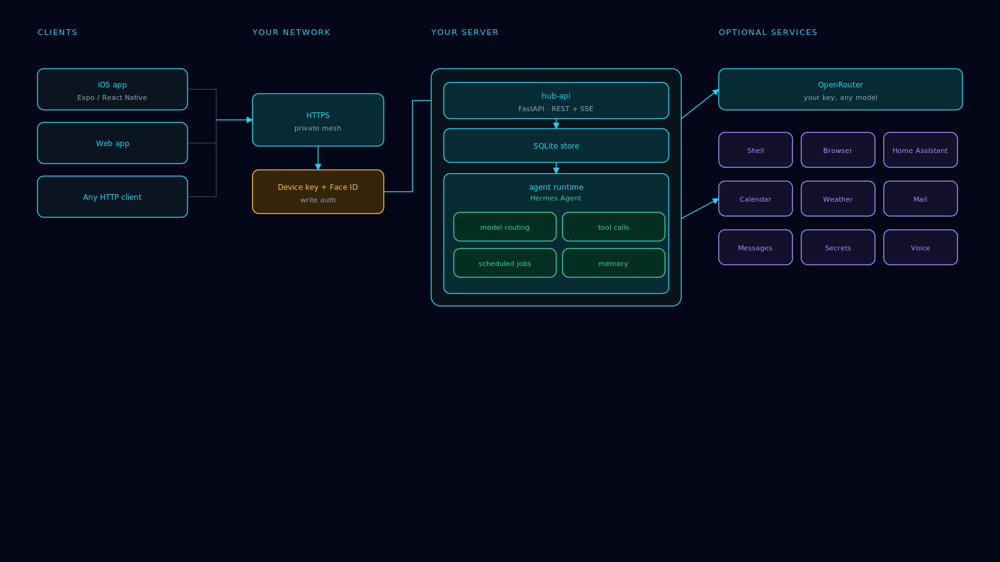

---

## Quick start (5 minutes)

**You need:** a machine that stays on (VPS, home server, or Mac) with
[Docker](https://docs.docker.com/engine/install/), Docker Compose v2, and
`bash` — the installer is a bash script. `curl` is used for the health check
when present, with a built-in fallback if it is not.

```bash
git clone https://github.com/lukenau/hub-stack.git
cd hub-stack
./install.sh
```

`install.sh` creates `.env`, builds the server, starts it, waits for health,
and prints the URL to point the app at. That's it.

```
✔ hub-api is up  →  http://127.0.0.1:8090

✔ Done.

  Point the app at:   http://127.0.0.1:8090   (this machine)
                      http://192.168.1.50:8090   (from another device on your network)

  Pair the app:       run  ./install.sh --pair  on this machine to mint a
                      one-time 6-character enrolment code, then enter it in the
                      app's Config → Security → Pair this iPhone. No token, no
                      login, nothing sent over the network.
```

Next, point the app at that URL and pair the device. Both happen in the app:
type the address into **Config → Server address** (no rebuild needed — this
user-set value wins over the build-time `expo.extra.apiBase` in `app/app.json`).
Pairing mints a one-time six-character code you run `./install.sh --pair` to
produce on the server machine — it is generated locally over a unix socket, so
nothing touches the network — and you type it into the app's
**Config → Security → Pair this iPhone** screen; the code is six characters from
A–Z (no `I`/`O`) and 2–9 (no `0`/`1`), single-use, and expires after 120 seconds
by default. (If you also run a Hub web UI, its **Config → Security** page can
mint the same code after a Face ID / passkey prompt — that UI is optional and is
not part of this repository.) The installer's `from another device` line above
is your machine's LAN address — on a VPS that is a private NIC reachable from
nothing until you add a mesh or proxy. Details:
**[docs/SETUP.md](docs/SETUP.md)** and **[docs/CONNECT-APP.md](docs/CONNECT-APP.md)**.

---

## Pick your host

| Where you run it | Guide | Best for |
|---|---|---|
| **VPS** (Hetzner, DigitalOcean, Fly…) | [docs/INSTALL-VPS.md](docs/INSTALL-VPS.md) | always-on, reachable anywhere |
| **Home server / NAS** | [docs/INSTALL-HOME-SERVER.md](docs/INSTALL-HOME-SERVER.md) | keeping data at home |
| **Mac** | [docs/INSTALL-MAC.md](docs/INSTALL-MAC.md) | trying it locally |

Each guide has annotated screenshots. Everyone should read
**[docs/CONNECT-APP.md](docs/CONNECT-APP.md)** afterward to secure the
connection (TLS and/or a private mesh) and pair the app. For the network side —
Tailscale, Headscale, WireGuard, Cloudflare Tunnel, or LAN-only — see
**[docs/MESH.md](docs/MESH.md)**.

---

## Murmur: Xavier's wearable capture sub-product

**Murmur** is a sub-product of Xavier — not a separate thing bolted on beside
it — and it earns its place on the part that is actually hard: the **BLE
passthrough**. A wearable audio recorder is inert on its own. Something has to
bond to it over Bluetooth, drain the audio it has been quietly recording to its
own flash, and hand that audio onward to be turned into something searchable.
That piece is Xavier, and it is what turns the hardware into memory.

So: a wearable recorder (any BLE wearable that records to on-board flash)
buffers your day on its own storage, and the bridge this repo ships drains it
over Bluetooth to a transcription backend you run, which produces
speaker-tagged transcripts and a memory index your assistant can search. The
custody story is the same one as everywhere else here — the audio leaves
hardware you own and lands on a machine you run, with no consumer cloud
anywhere in the path.

Murmur is **strictly optional**: most self-hosters have no wearable and will
not get one. Without a configured capture bridge the Murmur page does not
appear, and the hub you get is exactly the one documented everywhere else.
Full pipeline, hardware, and honest limits: **[docs/MURMUR.md](docs/MURMUR.md)**.

---

## What it looks like

<p align="center">
  
  
  
</p>

The app, dark and light themes, sample data throughout:

**Home, dark and light**

<p align="center">
  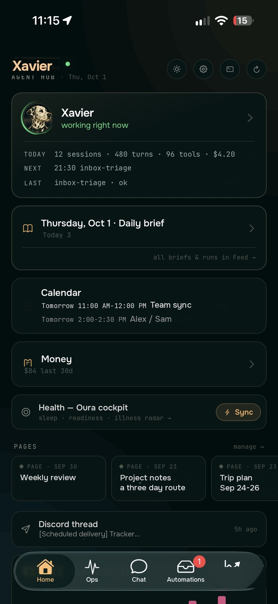
  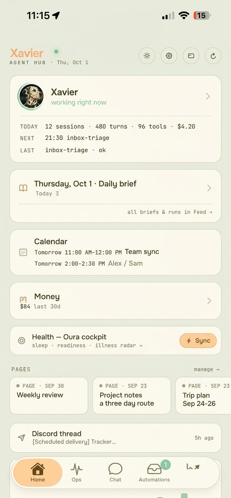
</p>

**Chat and threads**

<p align="center">
  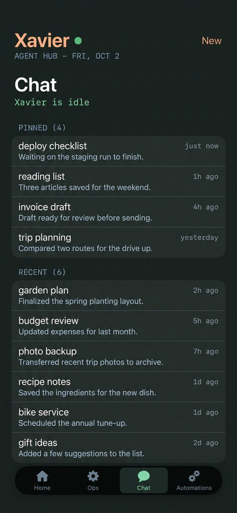
  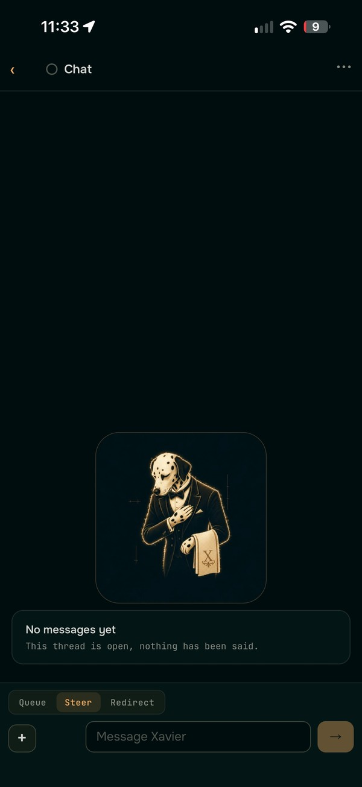
</p>

**Calendar**

<p align="center">
  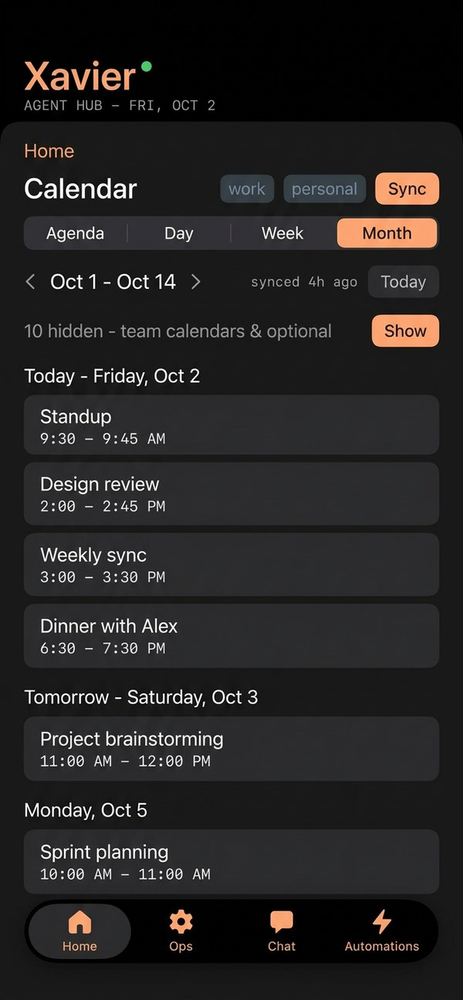
  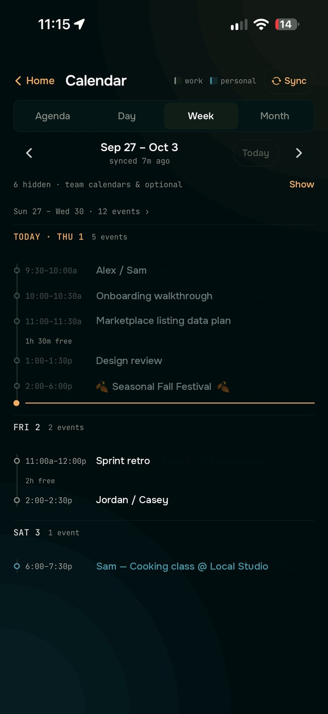
  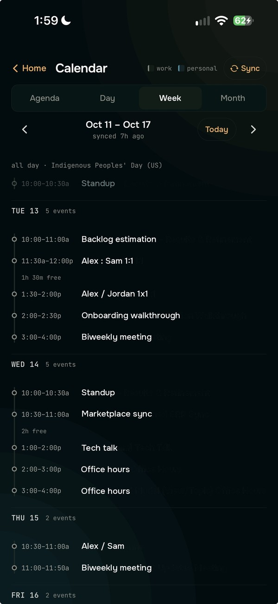
</p>

**Weather and cost**

<p align="center">
  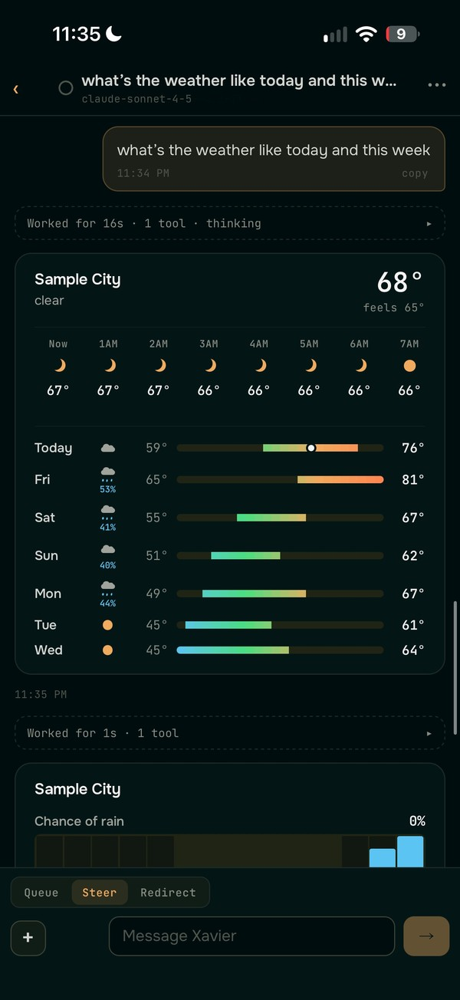
  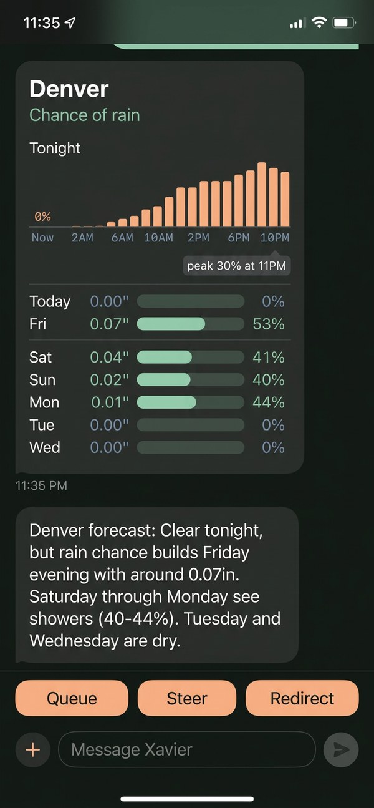
  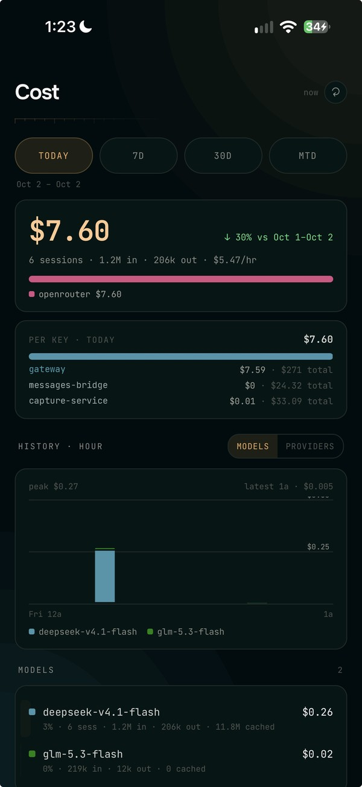
</p>

**Ops and automations**

<p align="center">
  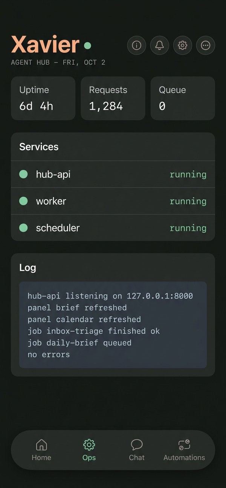
  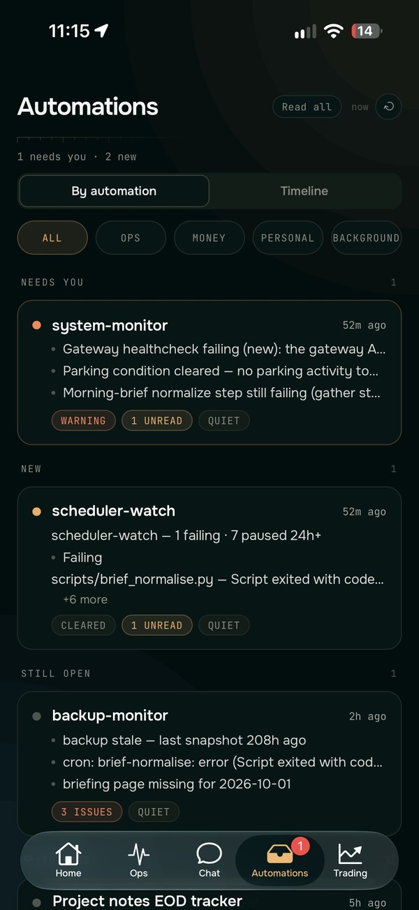
</p>

**Widgets**

<p align="center">
  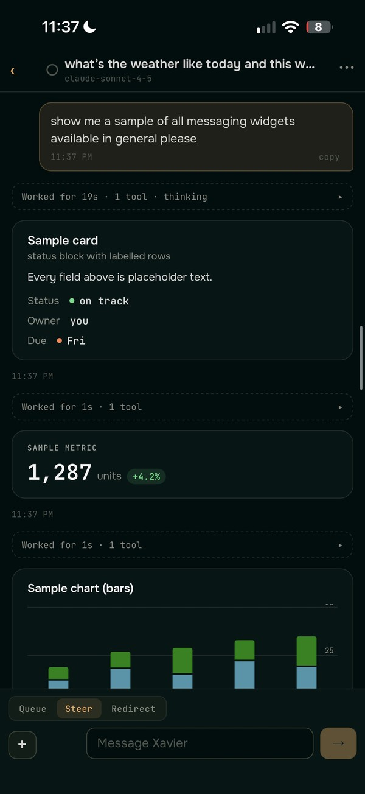
  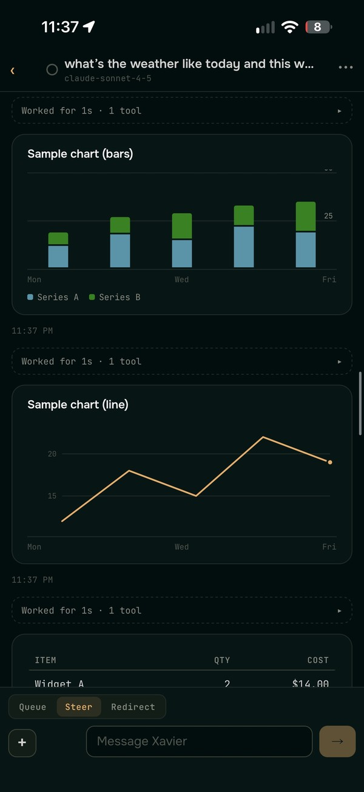
  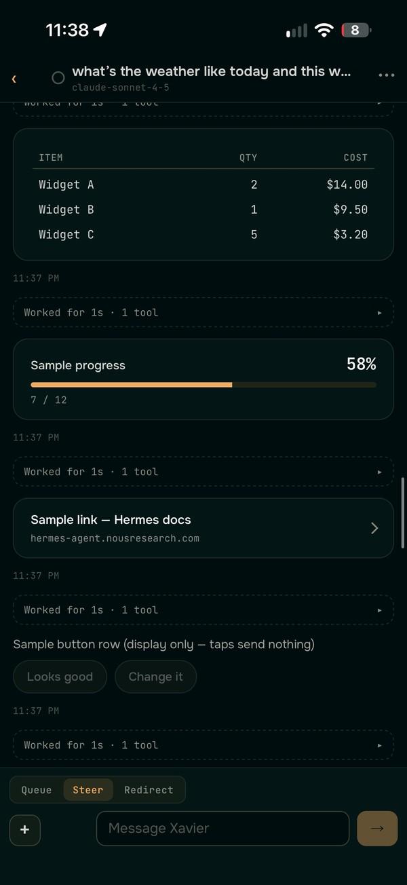
</p>

<p align="center">
  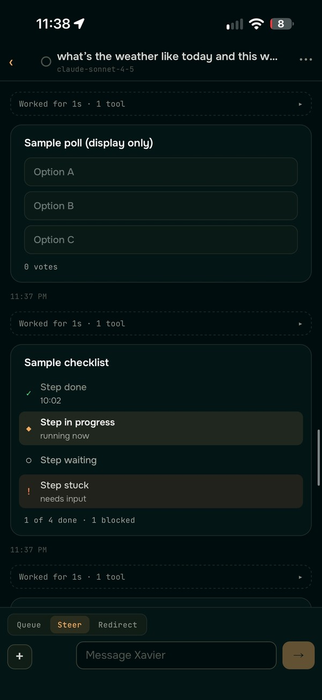
  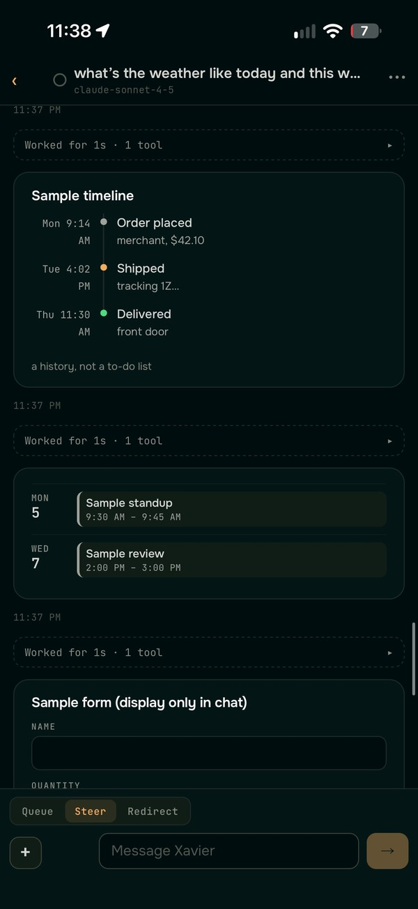
  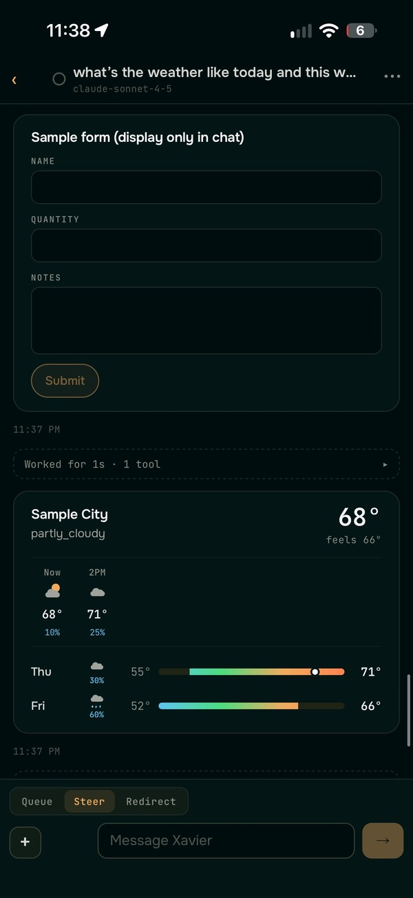
</p>

```
hub-stack/
├── install.sh              one-command bootstrap
├── docker-compose.yml      the server
├── .env.example            every setting, documented
├── server/                 hub-api — the FastAPI service (the "hub")
├── app/                    the Hub client (web + iOS + Android, Expo/React Native)
├── docs/                   setup, per-host installs, connect-the-app, troubleshooting
└── assets/img/             diagrams and install screenshots
```

---

## What actually does the work

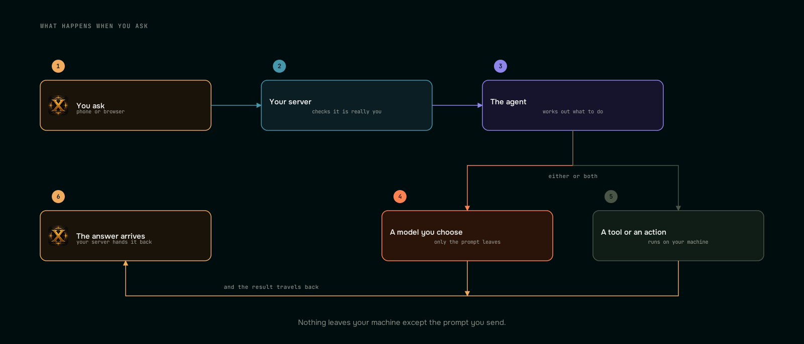


The hub is the **server and the app**. The intelligence behind it is an agent
runtime that lives outside this repo, and it's worth being explicit about which
piece does what, because most of the value is not in this codebase.

- **[Hermes Agent](https://hermes-agent.nousresearch.com/docs)** (Nous Research)
  — the agent runtime the hub talks to. It does the model calls, the tool use,
  the scheduled jobs and the memory; hub-stack is the server and the app in
  front of it. Point the hub at a Hermes instance and you get an assistant;
  without one, the hub is a dashboard and a chat shell. This is the piece that
  makes the rest useful.
- **[OpenRouter](https://openrouter.ai)** — one key for whichever model you want,
  instead of one integration per provider.
- **[Supermemory](https://supermemory.ai)** — optional long-term memory, so the
  agent remembers across sessions.
- **[Tailscale](https://tailscale.com)** — the private mesh that lets the app
  reach a server you never expose to the internet.
- **[Expo](https://expo.dev)** and **[React Native](https://reactnative.dev)** —
  the app, built and shipped with EAS.
- **[FastAPI](https://fastapi.tiangolo.com)** and **[Docker](https://www.docker.com)**
  — the server, and how you run it.

None of these are bundled with hub-stack. What is included, what is optional,
and what happens when a service is unset:
**[docs/INTEGRATIONS.md](docs/INTEGRATIONS.md)**.

---

## Integrations — what's included, what isn't

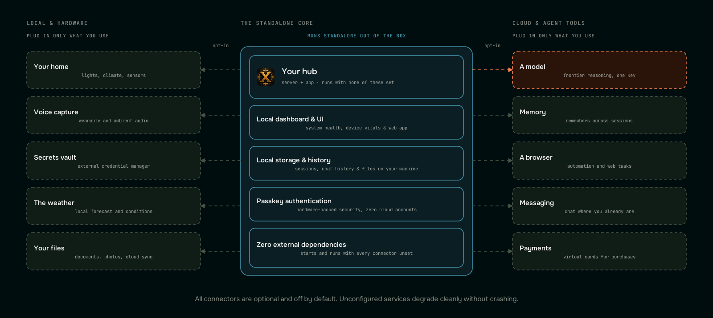


This repo is the **hub server + app**. It includes the code that talks to
several optional services but bundles **none of them** — the agent gateway
(Hermes), the memory provider, Murmur, iMessage, and OpenRouter all live
outside this repo (Murmur's pipeline is documented separately:
[docs/MURMUR.md](docs/MURMUR.md)). The hub runs standalone; panels whose service is unset
degrade instead of crashing. Full breakdown: **[docs/INTEGRATIONS.md](docs/INTEGRATIONS.md)**; per-service catalogue with env vars and `.env` blocks: **[docs/SERVICES.md](docs/SERVICES.md)**; agent-side tool connectors: **[docs/CONNECTORS.md](docs/CONNECTORS.md)**.

---

## Privacy — plainly

<p align="center">
  
</p>

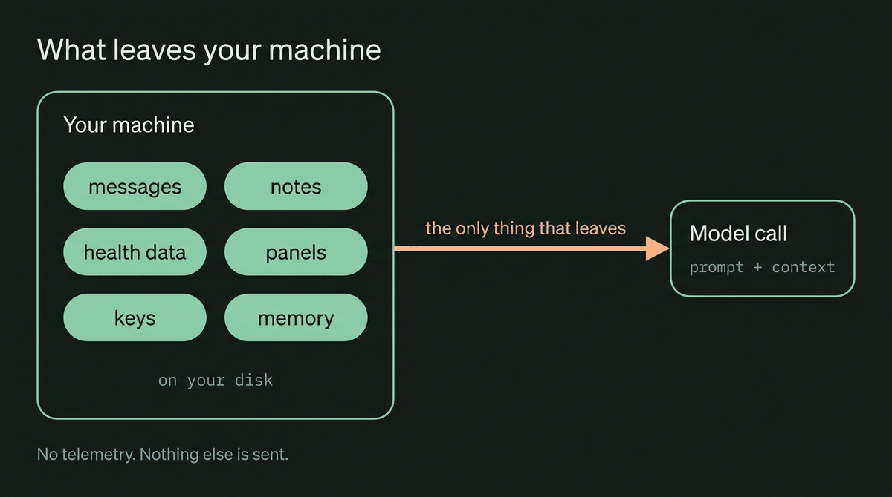


- **Your data never leaves your machine.** Everything the hub knows lives in
  `${HUB_DATA_DIR:-./data}` on the box you installed it on. There is no hub-stack
  cloud, no account to create, and no server of ours in the loop.
- **No telemetry, no analytics, no phone-home.** The server sends nothing to us
  and nothing to anyone else. The app contains no analytics SDK (no
  Sentry/Amplitude/Segment/PostHog). There is no "usage" reporting to disable.
- **The app talks only to the server you point it at.** You enter your server's
  address in the app, or bake it in at build time (`expo.extra.apiBase`). An
  unconfigured build carries a placeholder (`https://hub.example.com`) that leads
  nowhere; there is no hidden fallback to anyone else's server, and nothing the
  app contacts that you did not configure yourself.
- **Loopback by default.** The server binds `127.0.0.1` — unreachable from the
  network until *you* add TLS or a private mesh. It never opens an inbound port
  to the internet on its own.
- **Outbound calls only when you opt in.** Nothing is called out to unless you
  configure an integration (e.g. `OPENROUTER_API_KEY`, a Home Assistant URL) or
  you enable app OTA updates, which check the builder's EAS project. Blank =
  off.
- **No secrets in the repo.** `.env` is gitignored; credentials live there and
  nowhere else, and the publish gate (`scripts/hub-stack-gate.sh`) scans for
  committed keys.

If it is not your machine and not a service you switched on, hub-stack is not
talking to it.

---

## Security model

- The server binds to **loopback only** by default; nothing is reachable from
  the internet until *you* put a reverse proxy or mesh in front of it.
- **Reachability is the access boundary.** There is no login and no per-request
  token: anything that can reach the port can read what the server exposes.
  Writes additionally hit a Face ID device-key gate. Read
  [SECURITY.md](SECURITY.md) before exposing it — `HUB_API_TOKEN` in `.env` is
  reserved and **not enforced**.
- No telemetry, no phoning home, no hosted service.
- See [SECURITY.md](SECURITY.md) for the threat model and how to report issues.

## How this compares to hosted personal agents

A hosted agent is the obvious alternative. If you have seen Meta's **Muse**,
this is the same idea with one thing moved: the machine is yours instead of
theirs, and the model is whichever you choose instead of whichever they pick.
hub-stack is the software to be that machine, running on hardware you already
own, under a license that lets you read and change every line.

The difference that matters is custody, not features. With a hosted agent your
files, calendar, mail and transcript history live on someone else's computer,
under their terms, and leave with their product. Here they never leave your
network unless you point them somewhere. The trade is real and worth stating: a
hosted product is less work to start and is someone else's problem to keep
running. If you want zero setup, use one.

Full comparison, with sources and dated checks:
**[docs/COMPARISON.md](docs/COMPARISON.md)**.

---

## What it costs

Nothing here is a subscription, and there is no tier to unlock. The software is
MIT and runs on hardware you already have. What you actually pay is the parts
you plug into it. Figures below were checked against each vendor's own page on
**2026-10-01**; every one is optional except a model key.

| Thing | Cost | Shape |
|---|---|---|
| A machine to run it on | Free if you have one; a small VPS is €5.99/mo at Hetzner (CAX11) or $6–12/mo at DigitalOcean | Monthly, or one-time for hardware (~$150–350 for a ready-to-run home box) |
| Electricity, home server | ~$0.70–3.50/mo for a 5–25 W box | Utility |
| [OpenRouter](https://openrouter.ai) | Pay per token, plus a 5.5% fee on credit top-ups. Free models exist (25+, 50 requests/day). No published average spend | Per token, prepaid |
| [Tailscale](https://tailscale.com) | Free for personal use (6 users, unlimited devices). Paid from $8/user/mo | Free tier |
| [Cloudflare Tunnel](https://www.cloudflare.com) | Free (Zero Trust free plan) | Free |
| [Apple Developer Program](https://developer.apple.com/programs/) | $99/year — required only if you want the app on an iPhone via TestFlight or the App Store. Includes WeatherKit | Annual |
| [Browser Use](https://browser-use.com) | Free tier, then paid by usage | Optional |

**The short version:** if you already have a computer to leave on, the cheapest
sane setup is **$1–4/month**, essentially just electricity. A typical setup with
a small VPS and light paid model use runs **$20–35/month**. The only line you
cannot avoid if you want a phone app is Apple's $99/year.

Two honest blanks: OpenRouter publishes no average personal spend, so none is
quoted here, and hardware prices move with the market, so they are ranges.

---

## License

MIT for this project's own code — see [LICENSE](LICENSE). Third-party
components (bundled xterm.js, JetBrains Mono, and others) are listed with their
licenses in [THIRD-PARTY-NOTICES.md](THIRD-PARTY-NOTICES.md).

## Author

Built by **Luke Nau** — [GitHub](https://github.com/lukenau) · [LinkedIn](https://www.linkedin.com/in/lukenau).

Discussion, bug reports, and pull requests are welcome. Contributions are
accepted under the Developer Certificate of Origin, so sign your commits
(`git commit -s`). See [CONTRIBUTING.md](CONTRIBUTING.md).
