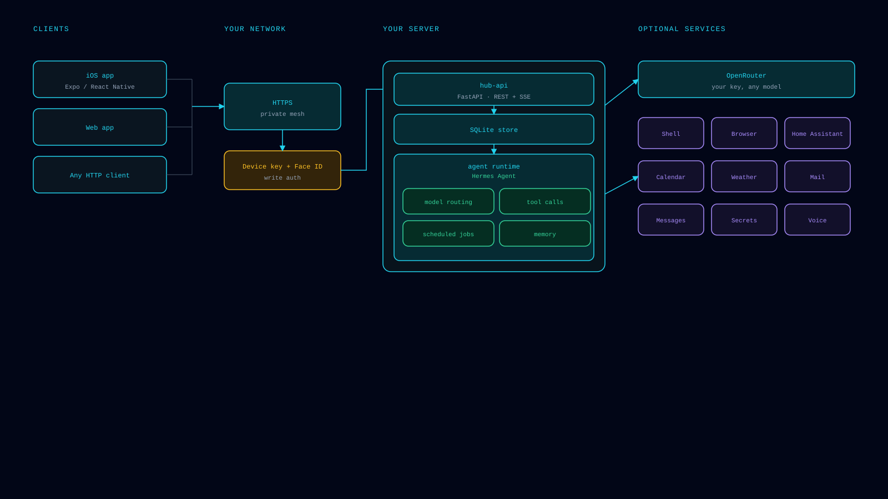

# Architecture

What the pieces are, how they talk, and why some choices are the way they
are.



---

## The big picture

hub-stack is a self-hosted client/server pair:

```
┌────────────────────┐        HTTPS (your network / private mesh)      ┌──────────────────┐
│   Hub app          │  ───────────────────────────────────────────▶  │   hub-api        │
│  (web / iOS /      │  ◀───────────────────────────────────────────  │  (this repo,     │
│   Android)         │              JSON over HTTP(S)                 │   FastAPI)       │
└────────────────────┘                                                └──────────────────┘
                                                                              │
                                                              local services / files / HA
```

- **`app/`** — the Hub client, built with Expo / React Native
  (Expo SDK 57, React Native 0.86, TypeScript, expo-router). One codebase,
  three targets: web (`npm run web`), iOS, Android.
- **`server/`** — **hub-api**, a FastAPI (Python) service. Runs in Docker,
  listens on `8090` inside the container, speaks JSON over HTTP(S).

There is no cloud service in between. The app talks directly to the server
you installed, over your own network or a private mesh — nothing is exposed
to the public internet unless *you* put a proxy there.

## Server internals

| Piece | What it does |
|---|---|
| `app.py` | The FastAPI app: read-only GET endpoints, the WebAuthn/device-key gate, middleware. |
| `files.py` | Read-only multi-root file browser (`/api/files/{roots,browse,read}`), traversal-guarded, size-capped. |
| `ha_actions.py` | Home Assistant action flow — challenge/apply, dry-run until `HA_LIVE_APPLY=true`. |
| `webauthn_gate.py` / `devicekeys.py` | Proof-of-presence for sensitive routes: WebAuthn (platform authenticator) or a native-app device-key signature. |
| `hub_calendar.py`, `chat/` | Calendar data and chat automation endpoints. |
| `Dockerfile` | `python:3.12-slim`, non-root user (uid = `HUB_UID`, default 1000), uvicorn on `0.0.0.0:8090` inside the container. |

### API surface

- **Liveness**: `GET /api/healthz` → `200`, `{"status":"ok"}`. Unauthenticated.
- **Read endpoints** (GET): health, agents, backups, audit, activity,
  schedules, skills, home-assistant state, calendar, my-pages, files. Reads
  carry no authentication of any kind: anyone who can reach the server can
  read it. Access control is the network boundary (private mesh, tailnet,
  or loopback) — see [SECURITY.md](../SECURITY.md).
- **Action endpoints** (POST): an explicit allowlist only — the terminal
  session flow (`/api/terminal/*`) and the Home Assistant flow
  (`/api/ha/challenge` → `/api/ha/apply`). Every POST is gated by a
  WebAuthn or device-key challenge; any other POST is rejected.
- **WebSocket**: the terminal view uses a WebSocket connection for the
  interactive session.

## Runtime shape

- **Docker Compose**, project name `hub-stack`, one service `hub-api`
  (image `hub-stack/hub-api:local`, built from `server/`).
- **Publishing**: `${HUB_BIND:-127.0.0.1}:8090:8090` on the host → `8090`
  in the container. Default `127.0.0.1` means loopback-only; exposure is
  the host publish's job, never the container's.
- **Data**: `HUB_DATA_DIR` (default `./data`) is bind-mounted to `/data`
  in the container — the database, uploads, and keys live there and
  survive rebuilds, restarts, and `--update`s.
- **Restart policy**: `unless-stopped` — the container comes back with the
  Docker daemon after a reboot.
- **Logs**: json-file driver, capped at 10 MB × 3 files.
- **Healthcheck**: the compose file polls `/api/healthz` in-process every
  30 s; the installer polls it from the host as well.

### Why a single worker

The WebAuthn challenge cache lives in-process, so the server must run as a
single uvicorn worker. Don't add `--workers`; scale vertically or add more
hubs instead.

### Why loopback by default

The container itself must bind `0.0.0.0` (it has no other interfaces from
its own point of view) — but the *host* publishes it on `127.0.0.1`, which
is what actually decides reachability. This means:

- fresh installs are unreachable from the network by default;
- a reverse proxy or Tailscale on the same host can front it without
  exposing the raw port;
- `HUB_BIND=0.0.0.0` is the explicit opt-in to LAN access, with no
  per-request authentication and no TLS — any device on the LAN can read
  everything. See the warning in [CONNECT-APP.md](CONNECT-APP.md).

## Configuration surface

Everything is environment-driven via `.env` (see
[SETUP.md](SETUP.md#configuration) for the full table). Key ones:

- `HUB_API_TOKEN` — **reserved, not enforced.** The server never reads this
  value and no endpoint requires it. It exists so existing installs keep
  working if request authentication is added later; do not rely on it to
  protect anything.
- `HUB_BIND` — host publish address.
- `HUB_DATA_DIR` — persistence.
- `HUB_ORIGIN` — CORS allowlist.
- `HUB_PUBLIC_BASE` — the URL advertised to clients.
- Optional integrations: Hermes gateway, Murmur bridge, Home Assistant
  (`HA_LIVE_APPLY` flips the HA apply flow from dry-run to live),
  OpenRouter.

## Security model

Summary — full details in [SECURITY.md](../SECURITY.md):

- Loopback by default; TLS/mesh is an explicit step you take.
- No request authentication on the API. Access control is the network
  boundary: private mesh, tailnet, or loopback — whoever can reach the
  server can read it.
- Writes are gated by WebAuthn/device-key proof of presence (Face ID /
  Secure Enclave), which is separate from — and not — request
  authentication.
- Read-mostly API with a small, explicit POST allowlist.
- Non-root container, no telemetry, no external calls home.

## Related reading

- [SETUP.md](SETUP.md) — install and configuration.
- [CONNECT-APP.md](CONNECT-APP.md) — exposure options and app pairing.
- [TROUBLESHOOTING.md](TROUBLESHOOTING.md) — when it doesn't work.
