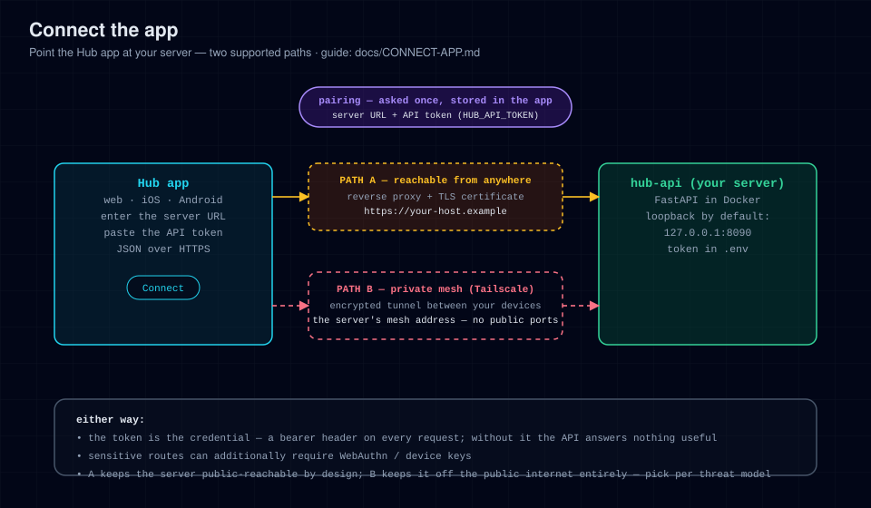

# Connect the app

The app needs one thing: a **reachable server**. This guide covers how to
make the server reachable in a safe way — the security step that actually
matters.

> **How the app authenticates (read this).** There is no login and no token to
> type in. The app talks to the server you point it at — the address you enter
> under **Config → Server address**, or the one baked in at build time — and
> *reachability is the access boundary*, so the mesh/TLS step below is the
> security step, not an optional extra. Writes are separately gated by a Face ID
> device key, and chat reads need that same paired key (see Step 2). See
> [SECURITY.md](../SECURITY.md).



---

## Step 1 — Make the server reachable

By default the server publishes on `127.0.0.1` only: nothing outside the
machine it runs on can connect. That's deliberate. Pick **one** way to open
it up:

### Option A — Tailscale (recommended)

> Full step-by-step, plus Headscale / WireGuard / Cloudflare Tunnel / LAN-only
> alternatives: **[MESH.md](MESH.md)**.

Encrypted private mesh, nothing exposed to the public internet, works from
home and away.

1. Install Tailscale on the server and on every device that will run the app.
2. On the server, forward to the loopback-published hub:

   ```bash
   sudo tailscale serve --bg --https=443 http://127.0.0.1:8090
   ```

3. In `.env`, set — Tailscale serves it over HTTPS, so the scheme is `https`:

   ```ini
   HUB_PUBLIC_BASE=https://<machine>.<tailnet>.ts.net
   HUB_ORIGIN=https://<machine>.<tailnet>.ts.net
   ```

   `<machine>.<tailnet>.ts.net` is the full hostname `tailscale serve status`
   prints; `<machine>` is the server's tailnet name and `<tailnet>` your
   tailnet's. `--https=443` also needs HTTPS certificates enabled for the
   tailnet in the Tailscale admin console — [MESH.md](MESH.md) covers this.

4. `docker compose up -d` to apply.

Your server URL is then `https://<machine>.<tailnet>.ts.net` — the exact address
you type into the app's **Config → Server address** (Step 2).

### Option B — TLS reverse proxy (public domain)

For a real domain with certificates (Caddy shown; nginx works the same way):

1. Keep `HUB_BIND=127.0.0.1` — the proxy connects to loopback, so the raw
   port is never exposed.
2. Caddyfile:

   ```caddy
   hub.example.com {
       reverse_proxy 127.0.0.1:8090
   }
   ```

3. Point DNS at the server, open `80`/`443` in the firewall.
4. In `.env`:

   ```ini
   HUB_PUBLIC_BASE=https://hub.example.com
   HUB_ORIGIN=https://hub.example.com
   ```

5. `docker compose up -d` to apply.

Your server URL is `https://hub.example.com`.

### Option C — LAN-only direct access (simplest, least secure)

Only for a trusted home network:

```ini
HUB_BIND=0.0.0.0
HUB_PUBLIC_BASE=http://192.168.1.50:8090    # server's LAN IP
HUB_ORIGIN=http://192.168.1.50:8090
```

Then `docker compose up -d`. Connections are plain HTTP inside your LAN, and
the server has no per-request authentication — any device on the LAN can read
everything the server exposes (chat excepted: it needs the paired key). Do not
do this on a shared or guest network.

> ⚠️ The app accepts `http://` only for `localhost` / `127.0.0.1`, so you
> **cannot** type `http://192.168.1.50:8090` into **Config → Server address** —
> it validates and refuses. A plain-HTTP LAN URL only works if you bake it in at
> build time (`expo.extra.apiBase`, which is not validated). For a URL you can
> type, use Option A or B — both are `https://`.

> ⚠️ **Do not bind `0.0.0.0` without a proxy or mesh in front.** A
> directly-exposed port has no authentication at all: anyone who can reach
> it reads everything, and the traffic is unencrypted. The only thing that
> limits what a client can *do* is the device-key write gate, which a
> stranger simply doesn't have. Never port-forward the hub port to the
> internet. If a machine on the network is untrusted (public Wi-Fi, shared
> VPS), use Option A or B.

---

## Step 2 — Pair the app

There is no token to paste, but there **is** a server field. Open
**Config → Server address** in the app and type your server URL — this value
wins over everything else. If you never set it, the app falls back to the
build-time `expo.extra.apiBase` in `app/app.json`, and failing that to the
`https://hub.example.com` placeholder in `app/src/lib/api.ts`. So:

- **To point an existing build at your server:** type the URL into **Config →
  Server address**. No rebuild needed.
- **To bake a default into a build you ship:** set `extra.apiBase` before
  building (see [PUBLIC-BUILD.md](PUBLIC-BUILD.md)).

Either way the address must be `https://` unless it is `localhost` /
`127.0.0.1` — that is the app's own rule, enforced when you save the field.

Pairing the device is the one in-app step, and it is what lets this phone
*write* — and read chat. Two devices are involved, and the buttons do **not**
have the same name:

1. **On the server machine:** run `./install.sh --pair`. It mints a one-time
   enrolment code inside the running server over a local unix socket — no
   browser and nothing over the network. (If you also run a Hub web UI, not part
   of this repository, its **Config → Security** page can mint the same code
   after a Face ID / passkey prompt; that UI is optional.)
2. **On the iPhone app:** open **Config → Security → Pair this iPhone** and type
   that code in before the countdown runs out. The code is six characters drawn
   from A–Z (without `I` or `O`) and 2–9 (without `0` or `1`); it is single-use
   and expires **120 seconds** after it is minted by default
   (`HUB_ENROLL_CODE_TTL_S` on the server).

3. The app generates a Secure Enclave key, posts the public half to
   `/api/devicekey/register`, and the device is trusted. From then on, Face
   ID authorises writes on this device.

Most reads need no pairing: as soon as the app can reach the server, the home
screen loads live data. **Chat is the exception** — the chat-data routes
(threads, messages, media, sends) all require the `hub_chat_session` cookie,
minted by the same Face ID device-key ceremony. So pairing turns on writes *and*
chat; without it, chat stays locked.

**Success looks like:** the app's home screen loads live data instead of an
empty/error state.

### Running the app from source (for development)

```bash
cd app
npm install
npm run web     # http://localhost:8081
npm run ios     # needs macOS + Xcode
npm run android # needs Android SDK / emulator or device
```

The default `HUB_ORIGIN=http://localhost:8081` already allows the web dev
server. The web build resolves its server the same way the native app does —
**Config → Server address** first, then `extra.apiBase` in `app/app.json`, then
the shipped default — so either set `extra.apiBase` before `npm run web`, or
point it at your server from inside the running app.

---

## Verify the connection

From any machine that should be able to reach the hub:

```bash
curl -fsS <your-server-url>/api/healthz
# → {"status":"ok"}
```

If that fails, the problem is network reachability, not the app — see
[TROUBLESHOOTING.md](TROUBLESHOOTING.md).

## Unpairing a device

To revoke a phone's ability to *write* (and to read chat), remove its device
key — with the **Config → Security** page if you run the Hub web UI, or by
deleting its entry from the server's `devicekeys.json`. The paired key stops
being trusted immediately and no new chat session can be minted with it. That
does **not** revoke the unauthenticated reads (activity, files, home automation
state…): those still answer anything that can reach the port, so also remove the
device from the network that reaches the server (its tailnet membership, mesh
credentials, or LAN access) — see [SECURITY.md](../SECURITY.md).
