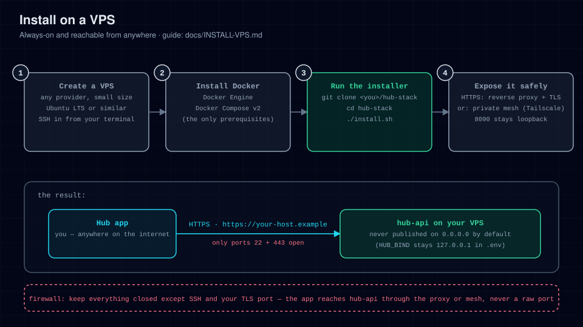

# Install on a VPS

Run the hub on a small cloud VM (any Debian 12 / Ubuntu 22.04+ box from
Hetzner, DigitalOcean, OVH, Linode, …). Best when you want it always-on and
reachable from anywhere.



## Prerequisites

- A VPS with at least 1 vCPU / 1 GB RAM, Debian 12 or Ubuntu 22.04+.
- SSH access as a sudo-capable user.
- Ports `22` open. **Nothing else needs to be open** — the hub binds to
  loopback by default; you reach it over a private mesh (recommended) or a
  TLS reverse proxy on the same host.

## Steps

1. **Install Docker Engine + Compose v2**

   ```bash
   curl -fsSL https://get.docker.com | sh
   sudo usermod -aG docker "$USER"   # log out and back in afterwards
   docker compose version            # must print a v2.x version
   ```

2. **Clone the repo**

   ```bash
   git clone https://github.com/lukenau/hub-stack.git
   cd hub-stack
   ```

3. **Run the installer**

   ```bash
   ./install.sh
   ```

   First run builds the image (about a minute) and waits for health.

   **Success looks like** (first run — on a later run the first line reads
   `✔ Using existing .env`):

   ```
   ✔ Created .env (mode 600)
   ✔ hub-api is up  →  http://127.0.0.1:8090
   ```

4. **Verify**

   ```bash
   curl -fsS http://127.0.0.1:8090/api/healthz
   # → {"status":"ok"}
   ```

   There is no token to pair the app with: pairing uses a one-time enrolment
   code minted from the Hub PWA, not `.env`. The server never reads
   `HUB_API_TOKEN` — see [SECURITY.md](../SECURITY.md).

5. **Lock down the firewall** (optional but good practice — the hub itself
   is already loopback-only)

   ```bash
   sudo ufw allow OpenSSH
   sudo ufw enable
   ```

   If you add a TLS reverse proxy (step 6, option B), also `sudo ufw allow 80,443/tcp`.

6. **Make it reachable from your devices** — pick **one**:

   **Option A — Tailscale (recommended, zero exposed surface).**
   Install Tailscale on the VPS and on every device:

   ```bash
   curl -fsSL https://tailscale.com/install.sh | sh
   sudo tailscale up
   sudo tailscale serve --bg --https=443 http://127.0.0.1:8090
   tailscale serve status   # prints your https://<machine>.<tailnet>.ts.net URL
   ```

   The app then uses that full `https://<machine>.<tailnet>.ts.net` hostname —
   Tailscale terminates HTTPS for it, so the scheme is `https`, not `http` — and
   it is never exposed to the public internet. `--https` needs HTTPS certificates
   enabled for the tailnet in the Tailscale admin console; [MESH.md](MESH.md)
   covers that. For a real domain with proper TLS, use option B.

   The installer's separate "from another device" URL is the VPS's **private NIC
   address**. On a VPS nothing can reach it until you add the mesh above or a
   proxy (option B), so use the Tailscale hostname on a VPS, not that address.

   **Option B — TLS reverse proxy (needed for a public domain).**
   Keep `HUB_BIND=127.0.0.1` — the proxy connects to loopback, so you do
   **not** open the port to the world. Example with Caddy (auto-HTTPS):

   Caddy is not in the default Debian/Ubuntu repositories, so add its
   official one first:

   ```bash
   sudo apt install -y debian-keyring debian-archive-keyring apt-transport-https curl
   curl -1sLf 'https://dl.cloudsmith.io/public/caddy/stable/gpg.key' | sudo gpg --dearmor -o /usr/share/keyrings/caddy-stable-archive-keyring.gpg
   curl -1sLf 'https://dl.cloudsmith.io/public/caddy/stable/debian.deb.txt' | sudo tee /etc/apt/sources.list.d/caddy-stable.list
   sudo apt update
   sudo apt install -y caddy
   ```

   `/etc/caddy/Caddyfile`:

   ```caddy
   hub.example.com {
       reverse_proxy 127.0.0.1:8090
   }
   ```

   ```bash
   sudo systemctl reload caddy
   ```

   Point DNS `A`/`AAAA` records for `hub.example.com` at the VPS and open
   `80,443` in the firewall.

7. **Finish the environment** — edit `.env` to match how you reach it:

   ```ini
   HUB_PUBLIC_BASE=https://hub.example.com     # or the tailnet URL
   HUB_ORIGIN=https://hub.example.com          # comma-separate extra origins
   HUB_USER_NAME=Your Name
   HUB_USER_HANDLE=you
   HUB_TZ=Europe/Berlin                        # your timezone
   ```

   ```bash
   docker compose up -d    # recreate with the new env
   ```

8. **Pair the app** — a one-time 6-character enrolment code from the Hub
   PWA's Config → Security page (no token, no login), per
   [CONNECT-APP.md](CONNECT-APP.md).

## Keeping it up to date

```bash
cd hub-stack
./install.sh --update
```

Run it weekly or on demand. Data persists in `HUB_DATA_DIR` (`./data`).

## Troubleshooting

See [TROUBLESHOOTING.md](TROUBLESHOOTING.md). VPS-specific notes:

- `docker: permission denied` → you skipped the `usermod -aG docker` step or
  didn't re-login.
- Nothing listens on 8090 from another machine → that's the default
  (`HUB_BIND=127.0.0.1`); follow CONNECT-APP.md instead of binding `0.0.0.0`.
