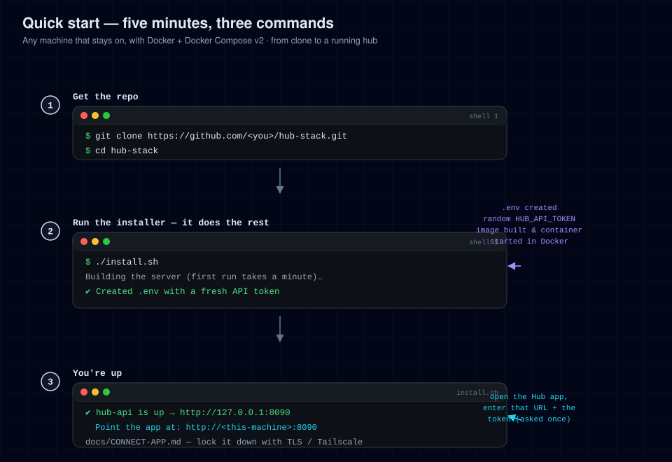

# Setup

This is the main setup guide. It covers the one-command quickstart that works
on any host, what `install.sh` actually does, and every configuration option.
For host-specific detail (VPS, home server, Mac) see the dedicated guides.

---

## Quickstart (5 minutes)

**You need:** a machine that stays on, with [Docker Engine](https://docs.docker.com/engine/install/)
and Docker Compose v2 (`docker compose version` must work).

```bash
git clone https://github.com/lukenau/hub-stack.git
cd hub-stack
./install.sh
```

On a first run, success looks like this:

```
✔ Created .env (mode 600)
✔ hub-api is up  →  http://127.0.0.1:8090
```

On any later run the first line is `✔ Using existing .env` instead (the
installer leaves an existing `.env` untouched), and the `hub-api is up` line
prints your `HUB_PORT` — `8090` by default.

Then pair the app with your server — see [CONNECT-APP.md](CONNECT-APP.md). There
is no token to enter: the app is paired with a one-time enrolment code you mint
on the server machine (`./install.sh --pair`), not with `HUB_API_TOKEN` (which
the server never reads — see the configuration table below).



---

## What `install.sh` does

In order:

1. **Checks prerequisites** — Docker present, Docker Compose v2 present,
   Docker daemon reachable. Any miss exits with a plain-English error.
2. **Creates `.env`** from `.env.example` (only if it doesn't exist) and
   seeds a sensible timezone from the system. An existing `.env` is kept
   untouched.
3. **Builds and starts** the server with `docker compose up -d --build`.
4. **Waits for health** — polls `http://127.0.0.1:${HUB_PORT}/api/healthz`
   (`8090` by default) every 2 s for up to 90 s, then points you at the logs if
   it never came up.
5. **Prints next steps** — the URL for the app and a pointer to CONNECT-APP.md.

`install.sh` modes (`./install.sh --help` prints all of them):

| Command | Effect |
|---|---|
| `./install.sh` / `--start` | Install or start (the default; steps above) |
| `./install.sh --update` | `git pull --ff-only`, rebuild, restart |
| `./install.sh --stop` | `docker compose down` |
| `./install.sh --restart` | `docker compose restart` |
| `./install.sh --logs` | Follow container logs (last 100 lines) |
| `./install.sh --status` | Show container state + health (`docker compose ps`) |
| `./install.sh --url` | Print the URL to point the app at |
| `./install.sh --uninstall` | Stop and delete all data (asks for confirmation) |

---

## Configuration

All settings live in `.env` (copied from `.env.example`). Every option is
commented there. The important ones:

### Server / network

| Variable | Default | Meaning |
|---|---|---|
| `HUB_BIND` | `127.0.0.1` | Host-side publish address. `127.0.0.1` = reachable from this machine only. Set `0.0.0.0` **only** when a reverse proxy or private mesh is in front — see [CONNECT-APP.md](CONNECT-APP.md). |
| `HUB_PORT` | `8090` | Host-side port the server is published on. The container always listens on `8090` internally; this moves only the host side. Set it in `.env` (or the environment) — `docker-compose.yml` reads `${HUB_PORT:-8090}`, so don't hand-edit the compose file. If you change it, point `HUB_PUBLIC_BASE` at the same port. |
| `HUB_API_HOST` / `HUB_API_PORT` | `0.0.0.0` / `8090` | Listen address inside the container. Leave as-is. |
| `HUB_UID` | `1000` | uid the container runs as. `install.sh` keeps it in step with the owner of `HUB_DATA_DIR` so the non-root container can write its db/uploads. Set it by hand only if you moved the data dir to a different owner. |
| `HUB_DATA_DIR` | `./data` | Host directory persisted into the container at `/data` (db, uploads, keys). |

The host **port** comes from `HUB_PORT` (default `8090`); `docker-compose.yml`
publishes `"${HUB_BIND:-127.0.0.1}:${HUB_PORT:-8090}:8090"`. Setting it in `.env`
also survives `./install.sh --update`, which a hand-edit of the compose file
would not.

### Identity / pairing

| Variable | Default | Meaning |
|---|---|---|
| `HUB_API_TOKEN` | *(empty)* | **RESERVED** — not enforced today. The server does not read this value and the API does not require it; access control is the network boundary (see SECURITY.md). install.sh no longer fills it. Do NOT rely on it to protect an exposed port. |
| `HUB_ORIGIN` | `http://localhost:8090` | **The origin a browser uses to reach the hub** (scheme + host + port). Required for passkeys: WebAuthn binds credentials to it, so it must match the browser's address bar. Leave it blank and passkey setup is refused with an error naming this variable. Comma-separated list; the first entry is the WebAuthn origin. |
| `HUB_RP_ID` | *(derived)* | Relying-party hostname the passkeys are scoped to. Derived from `HUB_ORIGIN`'s hostname; set it only when it must differ (e.g. `hub.example.com`). |
| `HUB_PUBLIC_BASE` | `http://localhost:8090` | Base URL the server advertises to clients. Set this to whatever URL the app will actually use. |
| `HUB_USER_NAME` / `HUB_USER_HANDLE` | `Your Name` / `you` | Display identity shown in the app. |
| `HUB_TZ` | `UTC` | Timezone for anything time-formatted. |

### Optional integrations

All blank by default — the hub runs standalone without any of them:

- `HERMES_API_BASE` / `HERMES_API_KEY` — point the hub at a Hermes gateway.
- `MURMUR_BRIDGE_URL` / `MURMUR_BRIDGE_TOKEN` — voice-transcription bridge.
- `HA_LIVE_APPLY` — `false` (dry-run) or `true` (live) for Home Assistant
  actions.
- `OPENROUTER_API_KEY` — LLM access.

After editing `.env`, restart to pick up changes:

```bash
docker compose up -d     # recreates the container with the new env
```

---

## Verify it's working

```bash
curl -fsS http://127.0.0.1:8090/api/healthz
# → {"status":"ok"}
```

Everything else (activity, files, home automation state…) is served without
authentication. The API has no per-request token: reachability is the access
boundary (see [SECURITY.md](../SECURITY.md)). **Chat is the exception** — every
chat-data route (threads, messages, media, sends) is gated by the
`hub_chat_session` cookie, which is minted by a Face ID device-key ceremony, so
*reading* chat needs a paired device key, not just writing it.

## Updating

```bash
./install.sh --update
```

Pulls the latest code (fast-forward only), rebuilds the image, and restarts.
Data in `HUB_DATA_DIR` survives all of this.

## Uninstalling

```bash
./install.sh --stop                          # stop the server
sudo rm -rf "${HUB_DATA_DIR:-./data}" .env   # data dir + secrets (irreversible)
```

---

## Where to next

- Pick your host: [INSTALL-VPS.md](INSTALL-VPS.md) ·
  [INSTALL-HOME-SERVER.md](INSTALL-HOME-SERVER.md) ·
  [INSTALL-MAC.md](INSTALL-MAC.md)
- Secure the connection and pair the app: [CONNECT-APP.md](CONNECT-APP.md)
- How it all fits together: [ARCHITECTURE.md](ARCHITECTURE.md)
- Something broken: [TROUBLESHOOTING.md](TROUBLESHOOTING.md)
